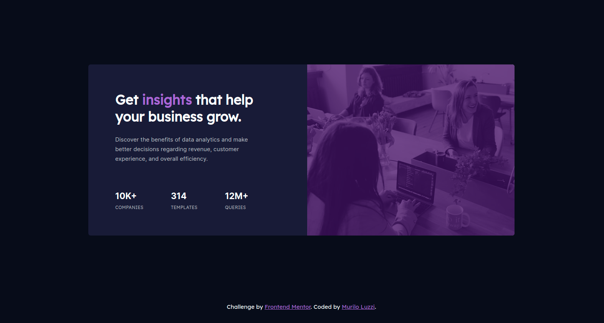

# Frontend Mentor - Stats preview card component solution

This is a solution to the [Stats preview card component challenge on Frontend Mentor](https://www.frontendmentor.io/challenges/stats-preview-card-component-8JqbgoU62). Frontend Mentor challenges help you improve your coding skills by building realistic projects. 

## Table of contents

- [Overview](#overview)
  - [The challenge](#the-challenge)
  - [Screenshot](#screenshot)
  - [Links](#links)
- [My process](#my-process)
  - [Built with](#built-with)
  - [What I learned](#what-i-learned)
  - [Continued development](#continued-development)
- [Author](#author)

## Overview

### The challenge

Users should be able to:

- View the optimal layout depending on their device's screen size

### Screenshot

### Links

- Solution URL: (https://mlzzi.github.io/Stats-preview-card-component/)

## My process

### Built with

- HTML5 basic
- CSS custom properties

### What I learned

My second project from Front End Mentor. I used only basic HTML and CSS. I still didn't learned Flexbox and Grid yet because I want to solidify my basic knowledge before moving on.

### Continued development

My next steps is to learn Flexbox and Grid. Also I will start Javascript learning.

## Author

- Linkedin - https://www.linkedin.com/in/muriloluzzi/
- Frontend Mentor - [@mlzzi](https://www.frontendmentor.io/profile/mlzzi)

